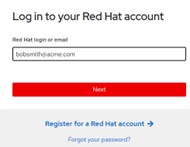
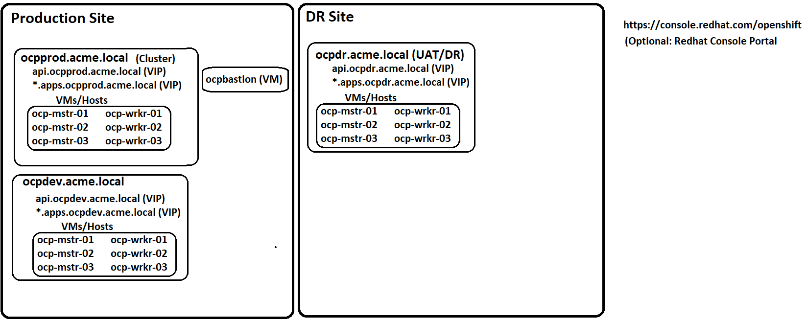

# Site Requirements Document

 This document is to ensure site has materials and details nessisary for Openshift deployment 

All items in RED  must be filled out prior to deployment date starts.

 

## Openshift Install
- [ ] [Common Deployment Assets](#VMWare-IPI-Deploy)
- [ ] [VMWare IPI Deploy](#VMWare-IPI-Deploy)
- [ ] [VMWare UPI Deploy](#VMWare-UPI-Deploy)
- [ ] [Git Token](#Git-Token)
- [ ] [Bear Metal or Assisted Installer Deploy](#Bear-Metal-or-Assisted-Installer-)

 

---------------------

## <b>  Common Deployment Assets for all Openshift Cluster Deployments </b>

### Login for RedHat Website with RHN subscription
RedHat Network Login ID. Its free... create one. This can / should be bound to company org ID to access keys and registrations.

https://cloud.redhat.com/openshift/install/vsphere/user-provisioned

Click "Copy Pull Secret and save

Review Cloud registered OCP clusters
https://console.redhat.com/openshift

<b>Network</b>
- DNS Server Primary
- DNS Server Secondary
- NTP Server Primary 
- NTP Server Secondary
- NTP Time Offset
- DNS Zone

 

---------------------

## <b>  VMWare IPI Deploy</b>
 

Diagram:

## <b> -- Host Table</b>
 

|  Hostname FQDN  |  IP  |  Gateway | Notes / Details |
| :--------------- | :---- | :--------------- | :--------------- |
| bastion.acme.com | 10.0.0.10/24 | 10.0.0.1 | Deployment bastion host running RHEL |
| vcenter.acme.com | 10.0.0.11/24 | 10.0.0.1 | vCenter server for hosting deployment  |
| dns01.acme.com | 10.0.0.12/24 | 10.0.0.1 | Primary Domain DNS server  |
| dns02.acme.com | 10.0.0.13/24 | 10.0.0.1 | Secondary Domain DNS server  |
| dns01.acme.com | 10.0.0.12/24 | 10.0.0.1 | Primary NTP server  |
| dns02.acme.com | 10.0.0.13/24 | 10.0.0.1 | Primary NTP server  |

## <b> -- vCenter Cluster Hardware Requirements</b>

 

Most customers will find successful for testing to reflect VMWare Resource available capacity of: 

- 32vCPU
- 128GB RAM
- 1TB SSD class Storage
- 1 Port Group (VLAN) with DHCP services routable to Internet
- limited user account. Ex: openshift@vshere.local

DHCP Scope Options Required:
- 002 TimeZone Offset 
- 003 router 
- 042 NTP server	
- 005 Name Server	
- 006 DNS Server	
- 015 DNS Domain Name	

## <b> -- DNS Record Table For Example Cluser</b>
 

Below is for one clsuter.  Ex:  ocpprod

Most sites will have three Ex: ocpprod, ocpdev, ocpdr 

|  Record Type  |  FQDN  |  IP | Notes / Details |
| :--------------- | :---- | :--------------- | :--------------- |
|  Zone | acme.com |  - | Base DNS domain for site |
|  Zone | ocpprod.acme.com |  - | For cluster "ocpprod" A and PTR for API and Admin interface of cluster |
| A/PTR | api.ocpprod.acme.com | 10.0.0.21 | For cluster "ocpprod" A and PTR for API and Admin interface of cluster |
|  Zone | apps.ocpprod.acme.com |  - | Subzone within zone for Openshift for applications |
|  A/PTR | *.apps.ocpprod.acme.com | 10.0.0.22 | Star record for applications within Openshift cluster |

 
Done.  Move on to next step...

 

---------------------

## <b>VMWare UPI Deploy</b>
 

<b>Coming soon to a CDW customer near you !!</b>

 

 

---------------------

## <b>Git Token</b>

 
The cusotmer for CI / CD integration needs access a shared "service account" where they can create a Group or Personal Access token.  There are many workflows and options for how to do this and can be matched to meet the application team's requirements, but the customer needs to have login and rights to create these code repo and tokens at deployment time, or, know what they need and provide this before deployment starts.

Ex:

|  Type  |  Name  |  Token | Notes / Details |
| :--------------- | :---- | :--------------- | :--------------- |
|  Git Lab Group Access Token | GAT_gitlab_ocp_acme |   [insert long token ]| This can be a group token authorized for all projects / code repos under this group. Authorization to run and call then is high level for all CI/CD for different apps under single runner |

This will be used post cluster deployment for each cluster to bind to CI process / resources:  Jenkins, ArgoCD etc..

 

---------------------

## <b>Secrets Store</b>

 
Storage for key/values and secrets that is CNI compliant
https://github.com/external-secrets/external-secrets

Ex: Azure , Google, AWS, Hashi Vault, KLM Server, etc...
    

 

---------------------

## <b>Bear Metal or Assisted Installer Deploy</b>

 

    

<b>
This is coming...  wait for it....  it will be super awsome and delicious!</b>

 