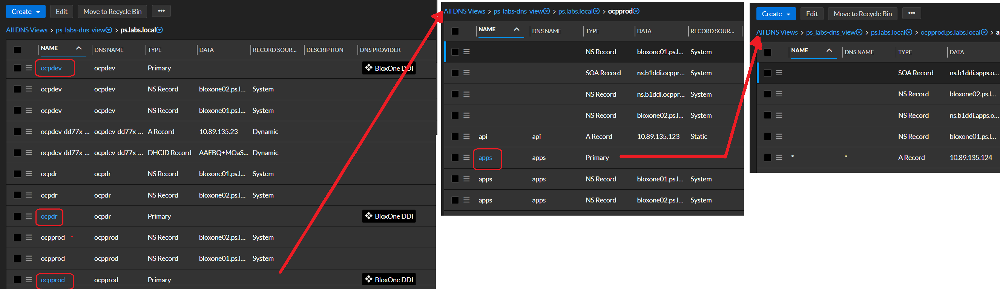

# This is how to prepare site for DNS to deploy Openshift if deployed onsite.  The below is based on IPI deployment.

## Steps for Deployment  - Choose one from below 
- [ ] [DNS Diagram](#dns-diagram])
- [ ] [DNS Microsoft Active Directory](#dns-microsoft-active-directory)
- [ ] [DNS Linux Webmin](#dns-linux-webmin)
- [ ] [DNS Infoblox](#dns-infoblox])


## <b> DNS Diagram </b>

~~~
.
├── acme.local
│   ├── ados.acme.local (A, SOA, NS, PTR) # Domain controller
│   └── ocpprod (zone) # zone for production cluster masters and workers
│     ├── api (A, PTR) # API / REST / Admin ingress VIP
│     ├── apps (zone) # zone for applications
│     └── api (A, PTR) # star record for all applications
│   └── ocpdev (zone) # zone for development cluster masters and workers
│     ├── api (A, PTR) # API / REST / Admin ingress VIP
│     ├── apps (zone) # zone for applications
│     └── api (A, PTR) # star record for all applications
│   └── ocpdr (zone) # zone for remote replication and UAT testing cluster masters and workers
│     ├── api (A, PTR) # API / REST / Admin ingress VIP
│     ├── apps (zone) # zone for applications
│     └── api (A, PTR) # star record for all applications
└── ocpbastion (A, PTR) # IP for deployment and cluster configuration and artifacts
~~~

</br>
</br>
</br>

***

## <b> DNS Microsoft Active Directory </b>

Refer to record table in 1a_site_requirements.md for records. Below are some quick screen shots on how you can do it in Microsoft AD and how it would look when completed.

DNS Add new Domain which is a DNS Zone


New Zone for each cluster


New A/PTR record for API VIP "*"

-

New A/PTR record for API VIP "*"

-


</br>

***

## <b> DNS Linux Webmin </b>

Refer to record table in 1a_site_requirements.md for records. Below are some quick screen shots on how you can do it in Linux BIND and how it would look when completed. This is GUI and also zone files provided.


</br>
</br>
</br>

***

## <b> DNS Infoblox] </b>

Refer to record table in 1a_site_requirements.md for records. Below are some quick screen shots on how you can do it in Inforblox Bloxone and how it would look when completed.  GUI and TF code stanza shown.

Base Zones PTR and Forward


Subzones


BloxOne PTR Zones


TF Subzones
```


```

TF A Records
```


```

TF PTR Records
```


```