# Configuration of keys and values in Cloud Vault for CI based cluster deployment with Argo

## Documentation

<br>

## Steps for Deployment

- [ ] [Checklist](#Checklist)
- [ ] [Create Keyvault - Azure](#Create-Keyvault - Azure)
- [ ] [Add Kustomize Layers in SCM](#Add-Kustomize Layers in SCM)
- [ ] [Apply to cluster](#Apply-to-cluster)

</br>

------
## <span style="color:green"><b> vCenter Configuation</span></b>

<br>

## <b> Key and Values</b>

| <span style="color:gold">Resource | <span style="color:gold">Name | <span style="color:gold">Notes</span> | 
| :--------------- | :---- | :--------------- |
| vCenter FQDN|<span style="color:red"> vcenter01.acme.com | version 7.0.3 |
| Access |<span style="color:red"> openshift@acme.com | Roles defined and bound per above |
| Resource Pool|<span style="color:red"> Normal_VMs | Optional but helpful |


<br>

------
## <span style="color:green"><b> Checklist</span></b>

<br>


blah

<br>

------
## <span style="color:green"><b> Create an htpasswd file </span></b>

```bash
htpasswd -cBb user.htpasswd ocpadmin1 '<password>'
htpasswd -Bb user.htpasswd ocpadmin2 '<password>'
htpasswd -Bb user.htpasswd ocpuser1 '<password>'
htpasswd -Bb user.htpasswd ocpuser2 '<password>'
htpasswd -Bb user.htpasswd devimagereader '<password>'
htpasswd -Bb user.htpasswd devimagecreator '<password>'
```


<br>

------
## <span style="color:green"><b> Create CA Export for Domain</span></b>


Step 1:  Create SANS template 

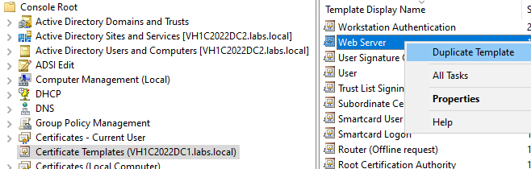


Step 2: Create Cert Request (CSR)

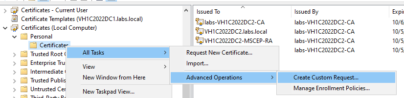


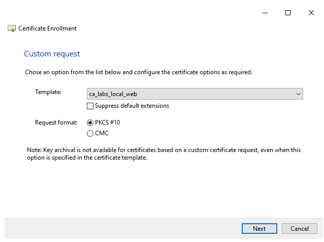


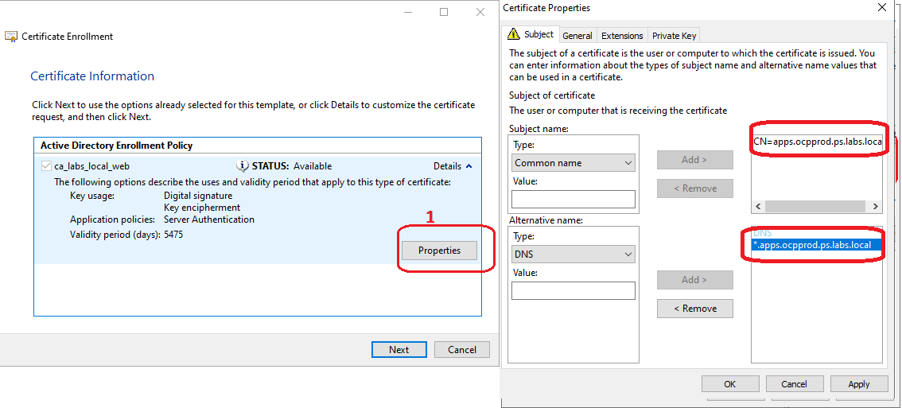


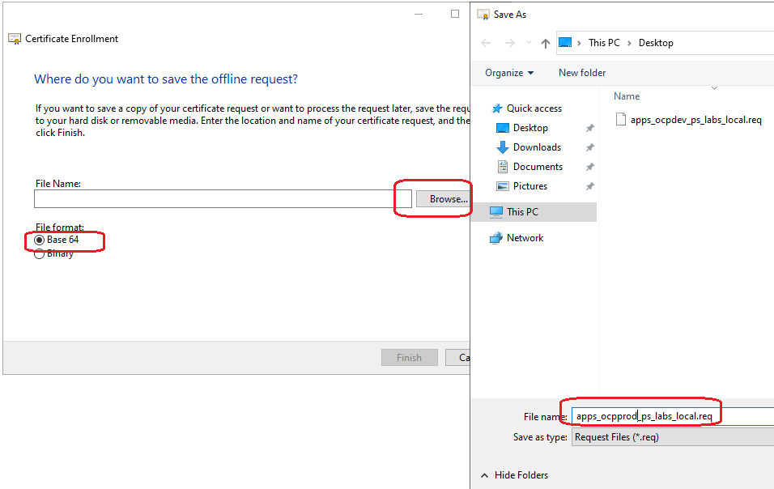


Step 3: Issue Cert from CSR for cluster

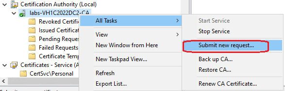


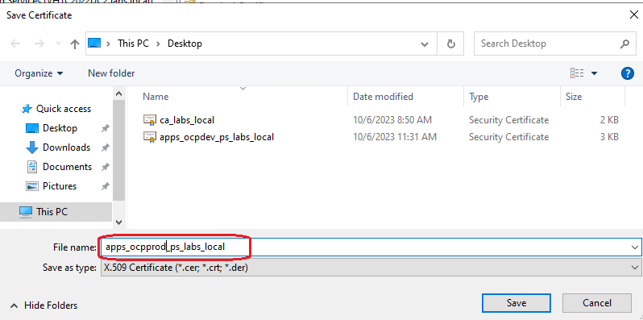

Export as Local Computer

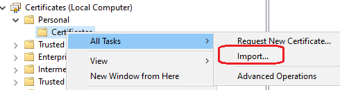

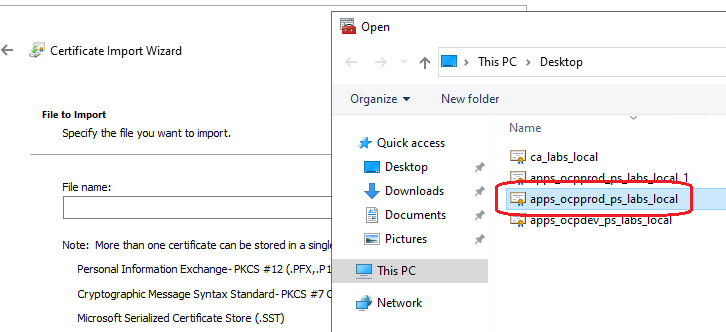


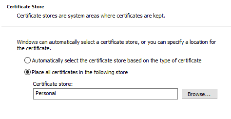

double click key in list to open it -> Details -> copy to file
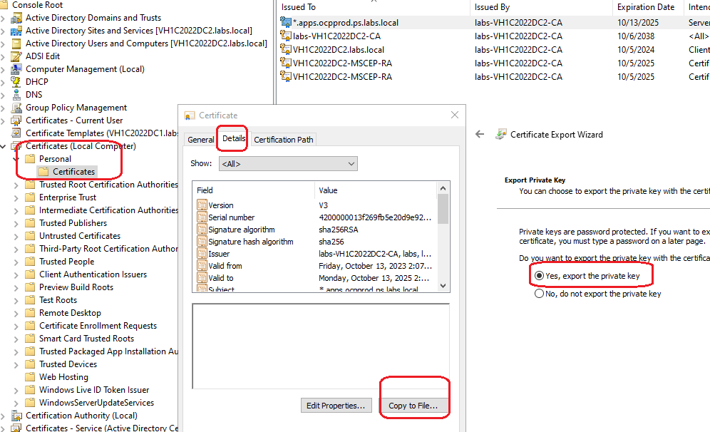


Export cetificiate pfx

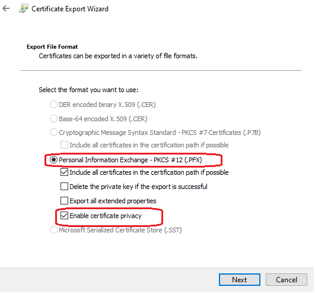


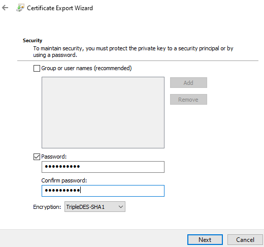

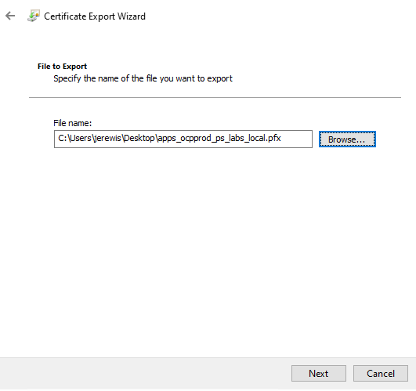


how to extract public (.crt) and private (.key) keys from a pfx file


```bash
# Convert file
# Will prompt for a password - get this from the person who exported the pfx file
# Will prompt for a passcode - make one up and use it in the decrypt command
openssl pkcs12 -in apps_ocpdev_ps_labs_local.pfx -nocerts -out encrypted-apps.key

 

# Decrypt the private key
# Will prompt you to enter the passcode you created in the previous command
openssl rsa -in encrypted-apps.key -out decrypted-apps.key

 

# Export the public key
openssl pkcs12 -in apps_ocpdev_ps_labs_local.pfx -clcerts -nokeys -out apps.crt
```

edit  "apps.crt"

Now remove header of garbage from top of file

Till line ---- BEGIN....

```
-----BEGIN CERTIFICATE-----
MIIFxjCCBK6gAwIBAgITQgAAABPyafteINnpLgAAAAAAEzANBgkqhkiG9w0BAQsF
ADBLMRUwEwYKCZImiZPyLGQBGRYFbG9jYWwxFDASBgoJkiaJk/IsZAEZFgRsYWJz
MRwwGgYDVQQDExNsYWJzLVZIMUMyMDIyREMyLUNBMB4XDTIzMTAxMzE5MDcwMFoX
DTI1MTAxMzE5MTcwMFowSzEiMCAGA1UEAxMZYXBpLm9jcHByb2QucHMubGFicy5
<snip>

```

<br>

------
## <span style="color:green"><b> Now upload keys to Azure Key Vault </span></b>


Make sure you've already created a Key Vault in Azure for this cluster (ex: ocpprod-ps-labs-local).

```bash
az login

RG=ps-labs-local
SP_NAME=ocpprod-ps-labs-local
SUBSCRIPTION=$(az account show -o tsv --query id)
KV=ocpprod-ps-labs-local

# Create a Service Principal with its Key Vault permissions
az ad sp create-for-rbac -n $SP_NAME --role="Key Vault Secrets User" \
  --scopes /subscriptions/$SUBSCRIPTION/resourcegroups/$RG/providers/Microsoft.KeyVault/vaults/$KV

# Create a secret for external-secrets to authenticate to Azure Key Vault 
APP_ID="get from the output of the az command"
PASSWORD="get from the output of the az command"
NAMESPACE=external-secrets
kubectl create secret generic external-secrets-azure -n $NAMESPACE \
  --from-literal=ClientID=$APP_ID \
  --from-literal=ClientSecret=$PASSWORD

# Add the secrets to your ey Vault
az keyvault secret set --vault-name "ocpprod-ps-labs-local" --name "ingress-tls-crt" --file apps.crt
az keyvault secret set --vault-name "ocpprod-ps-labs-local" --name "ingress-tls-key" --file decrypted-apps.key
az keyvault secret set --vault-name "ocpprod-ps-labs-local" --name "htpasswd-file" --file user.htpasswd
az keyvault secret set --vault-name "ocpprod-ps-labs-local" --name "ldap-bind-password" --value "mypass1234"
az keyvault secret set --vault-name "ocpprod-ps-labs-local" --name "ldap-bind-dn" --value "CN=Open Shift,OU=ps,DC=labs,DC=local"

```

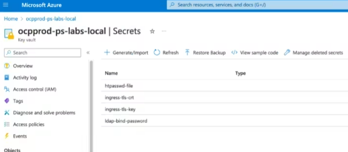


Success!

