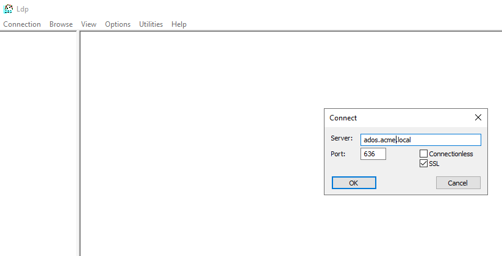
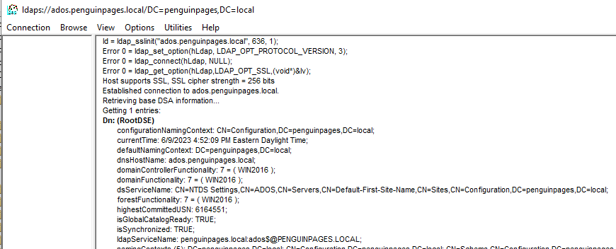
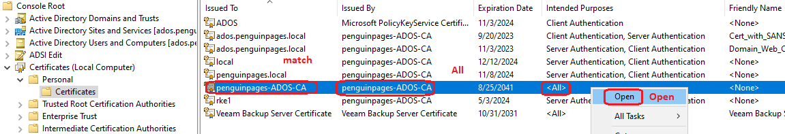
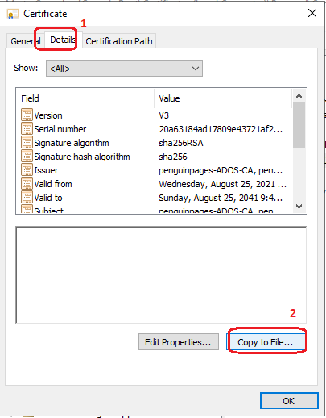
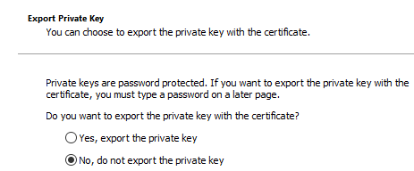
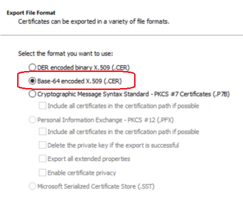
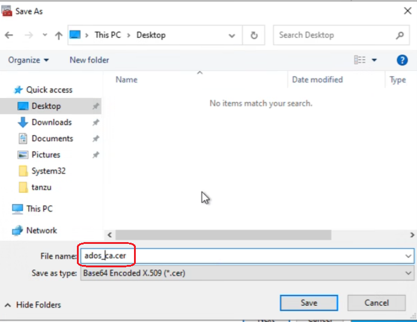

# Role Based binding and control using Microsoft Active Directory


## <span style="color:green"><b> AD Requirements</b></span>

Network:  Communication from API Cluster VIP to AD DC(s) servers

- TCP 636 LDAPS
- TCP 389 LDAP

<br>

LDAP Search User: (this can be same user binding for other deployment automations Ex: vcenter account)

Ex:  openshift@acme.local

Make sure to document password as this will be needed to create secrets search within OCP.

<br>

## <span style="color:green"><b> Optional: Tokens and Certificates</b></span>

From AD domain controller.  Check for LDAPS working.
Launch "ldp.exe" -> Connect -> localhost fqdn -> SSL with 636



If get response back..  your ok



Launch "certlm.mmc"











Ex: ados_ca.cer

Copy over the ocpbastionhost   /home/core/rbac/ad/ados_ca.cer

Create configuration map for certificate file. 

```
oc create configmap ca-config-map --from-file=ca.crt=/home/core/rbac/ad/ados_ca.cer -n openshift-config

```

<b>Note:</b> This cert file is uploaded here for authentication and sync, two locations.  As such, changes with this cert must be changed in BOTH locations

<br>

## <span style="color:green"><b> LDAP Groups and Users</b></span>

Workflow for a new applcation would create a new "Procject" (NameSpace), and you can then use that name logic for permssion bindings to deploy and manage that NameSpace in Kubernetes

Ex:  TestApp01  New Project

| <span style="color:gold"> AD User </span> | <span style="color:gold"> AD Group </span> | <span style="color:gold">Notes / Details</span> |
| :--------------- | :--------------- | :--------------- |
| <span style="color:red">TestApp01_admin1.acme.com |<span style="color:red"> TestApp01_admin | test admin account in group for admin tasks for application |
| <span style="color:red">TestApp02_admin1.acme.com |<span style="color:red"> TestApp01_admin | Second test admin account in group for admin tasks for application |
| <span style="color:red">TestApp02_dev1.acme.com |<span style="color:red"> TestApp01_dev | test developer account in group for developers tasks for application |
| <span style="color:red">TestApp02_dev1.acme.com |<span style="color:red"> TestApp01_dev | Second test developer account in group for developers tasks for application |

**Red above is customer to fill in for there customization / example

<br>
<br>

## <span style="color:green"><b>Configure LDAP IDP </b></span>

Documentation:  https://docs.openshift.com/container-platform/4.9/authentication/identity_providers/configuring-ldap-identity-provider.html


### 1.1 Create ldap-secret used by service account for ldap lookup
```
oc create secret generic ldap-secret --from-literal=bindPassword=<secret> -n openshift-config 
```

### 1.2  LDAPS - Create CA if needed
  * This is required if your are using LDAPs
  * You should already have a CA setup at this point
  * If you have a system-wide proxy setup to trust CAs, omit this

ldap-oauth-cr.yaml
```
apiVersion: config.openshift.io/v1
kind: OAuth
metadata:
  name: cluster
spec:
  identityProviders:
  - name: ldapidp 
    mappingMethod: claim 
    type: LDAP
    ldap:
      attributes:
        id: 
        - sAMAccountName
        email: 
        - mail
        name: 
        - cn
        preferredUsername: 
        - sAMAccountName
      bindDN: "CN=ocp_ldap,CN=Users,DC=acme,DC=local" 
      bindPassword: 
        name: ldap-secret
      ca:
        name: ca-config-map
      insecure: false
      url: "ldaps://ados.acme.local:636/DC=acme,DC=local?sAMAccountName?sub" 
```


### 1.3 Configure the OAuth Provider
NOTE: Check to see if there are any other auth providers enabled. If there are, creating this will overwite them.
If there are other oauth providers, edit this CR instead and add this to the list of providers
Edit and Create the LDAP CR

```
oc apply -f ./rbac/ad/ldap-oauth-cr.yaml
```

### 1.4 Test Login
  
Note: check for the auth operator to restart

```
oc get -n openshift-authentication pod
```

Anyone should be able to login now, but not see/do anything.

<b>Note: </b> Default account has ability to create namespaces, this is why we strongly suggest limiting login rights to Openshift

You can check via console or with the oc command
oc login -u <username>

Ex: openshift@acme.local

```
[core@ocpbastion ~]$ oc login -u openshift
Authentication required for https://api.ocpdev.acme.local:6443 (openshift)
Console URL: https://api.ocpdev.acme.local:6443/console
Username: openshift
Password:
Login successful.

You don't have any projects. You can try to create a new project, by running

    oc new-project <projectname>


```
Note:  Without bindings to projects / namespaces you will not have permissions


## 2. Setup LDAP Sync

<br>

LDAP sync is done with a cronjob. 

<br>

Create LDAP Sync file

vi /home/core/rbac/ad/ldap-sync-config.yaml

```
---
kind: ServiceAccount
apiVersion: v1
metadata:
  name: ldap-group-syncer
  namespace: openshift-config
---
apiVersion: rbac.authorization.k8s.io/v1
kind: ClusterRole
metadata:
  name: ldap-group-syncer
rules:
  - apiGroups:
      - ''
      - user.openshift.io
    resources:
      - groups
    verbs:
      - get
      - list
      - create
      - update
---
kind: ClusterRoleBinding
apiVersion: rbac.authorization.k8s.io/v1
metadata:
  name: ldap-group-syncer
subjects:
  - kind: ServiceAccount
    name: ldap-group-syncer              
    namespace: openshift-config
roleRef:
  apiGroup: rbac.authorization.k8s.io
  kind: ClusterRole
  name: ldap-group-syncer                
---
kind: ConfigMap
apiVersion: v1
metadata:
  name: ldap-group-syncer
  namespace: openshift-config
data:
  whitelist.txt: |
    CN=ocp_admins,CN=Users,DC=acme,DC=local # Edit for your site
    CN=ocp_users,CN=Users,DC=acme,DC=local # Edit for your site
  sync.yaml: |
    kind: LDAPSyncConfig
    apiVersion: v1
    url: ldaps://ados.acme.local:636 # Edit for your site
    insecure: false
    # The CA cert will be mounted into the sync CronJob pod from ca-config-map
    ca: /etc/ldap-ca/ca.crt
    bindDN: "CN=ocp_ldap,CN=Users,DC=acme,DC=local" # Edit for your site
    bindPassword:
      file: "/etc/secrets/bindPassword"
    augmentedActiveDirectory:
      groupsQuery:
        # baseDN and scope are ignored when using "memberOf:1.2.840.113556.1.4.1941:" 
        # baseDN: "CN=Users,DC=acme,DC=local" # Edit for your site
        # scope: sub
        derefAliases: never
        pageSize: 0
      groupUIDAttribute: dn 
      groupNameAttributes: [ cn ] 
      usersQuery:
        baseDN: "CN=Users,DC=acme,DC=local" # Edit for your site
        scope: sub
        derefAliases: never
        filter: (objectclass=person)
        pageSize: 0
      # Use either "sAMAccountName" or "mail", it should match the OAuth resource
      userNameAttributes: [ sAMAccountName ]
      # For group nesting, use "memberOf:1.2.840.113556.1.4.1941:" instead of "memberOf"
      groupMembershipAttributes: [ "memberOf:1.2.840.113556.1.4.1941:" ]
---
kind: CronJob
apiVersion: batch/v1
metadata:
  name: ldap-group-syncer
  namespace: openshift-config
spec:                                                                                
  schedule: "*/30 * * * *"                                                           
  concurrencyPolicy: Forbid
  jobTemplate:
    spec:
      backoffLimit: 0
      ttlSecondsAfterFinished: 1800                                                  
      template:
        spec:
          containers:
            - name: ldap-group-sync
              image: "registry.redhat.io/openshift4/ose-cli:latest"
              command:
                - "/bin/bash"
                - "-c"
                - "oc adm groups sync --sync-config=/etc/config/sync.yaml --whitelist=/etc/config/whitelist.txt --confirm" 
              volumeMounts:
                - mountPath: "/etc/config"
                  name: "ldap-sync-volume"
                - mountPath: "/etc/secrets"
                  name: "ldap-bind-password"
                - mountPath: "/etc/ldap-ca"
                  name: "ldap-ca"
          volumes:
            - name: "ldap-sync-volume"
              configMap:
                name: "ldap-group-syncer"
            - name: "ldap-bind-password"
              secret:
                secretName: "ldap-secret"                                            
            - name: "ldap-ca"
              configMap:
                name: "ca-config-map"                                                
          restartPolicy: "Never"
          terminationGracePeriodSeconds: 30
          activeDeadlineSeconds: 500
          dnsPolicy: "ClusterFirst"
          serviceAccountName: "ldap-group-syncer"

```


Upload cetfificate for authorization to new ldap-sync project

```
oc create configmap ca-config-map --from-file=ca.crt=/home/core/rbac/ad/ados_ca.cer -n ldap-sync
```

<b>Note:</b> This cert file is uploaded here for authentication and sync, two locations.  As such, changes with this cert must be changed in BOTH locations


Deploy ldap-sync configuration 

```


```


### 2.1 Edit and Create the LDAP Sync secret

NOTE: If you need nested groups. See here for the configuration
  * https://docs.openshift.com/container-platform/4.9/authentication/ldap-syncing.html
  
  * Duplicate this from the LDAP IDP configuration
  * Omit the CA if it was configured cluster-wide
  * Make sure each group desired is mapped
  * Also, ensure each group is in the whitelist

```
oc create secret generic ldap-sync \
    --from-file=ldap-sync.yaml=ldap-sync.yaml \
    --from-file=whitelist.txt=whitelist.txt \
    --from-file=ca.crt=ca.crt
```

### 2.2 Setup the Role, ServiceAccount, and RoleBinding
```
oc create clusterrole ldap-group-sync \
    --verb=create,update,patch,delete,get,list \
    --resource=groups.user.openshift.io

oc create sa ldap-sync
oc adm policy add-cluster-role-to-user ldap-group-sync \
    -z ldap-sync \
    -n ldap-sync
```

### 2.3 Edit and create the Sync cronjob

```
oc create -f ./cron-ldap-sync.yaml
```

### 2.4 Test LDAP Sync
```
kubectl create job --from=cronjob/<name of cronjob> <name of job>
```

### 2.5 Create RoleBindings for each group
Cluster Admins
```
oc adm policy add-cluster-role-to-group cluster-admin <groupname>
```

Cluster ReadOnly
```
oc adm policy add-cluster-role-to-group cluster-reader <groupname>
```


<br>

## <span style="color:green"><b> Binding within Openshift</b></span>


<br>

## <span style="color:green"><b>Testing and Debug</b></span>


<br>

## <span style="color:green"><b>Example Project/NameSpace Binding</b></span>


<br>

## <span style="color:green"><b> Audit and Loggin</b></span>

